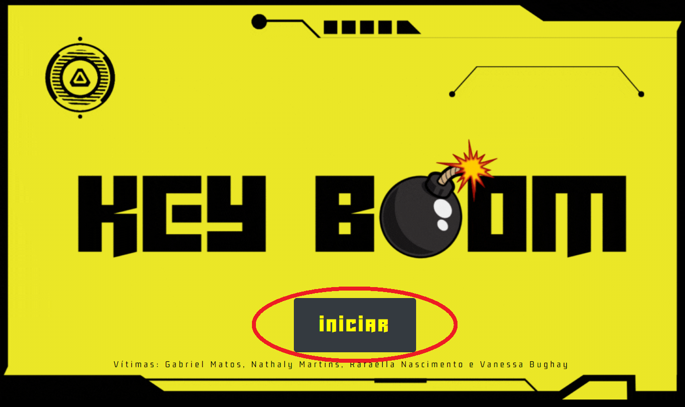
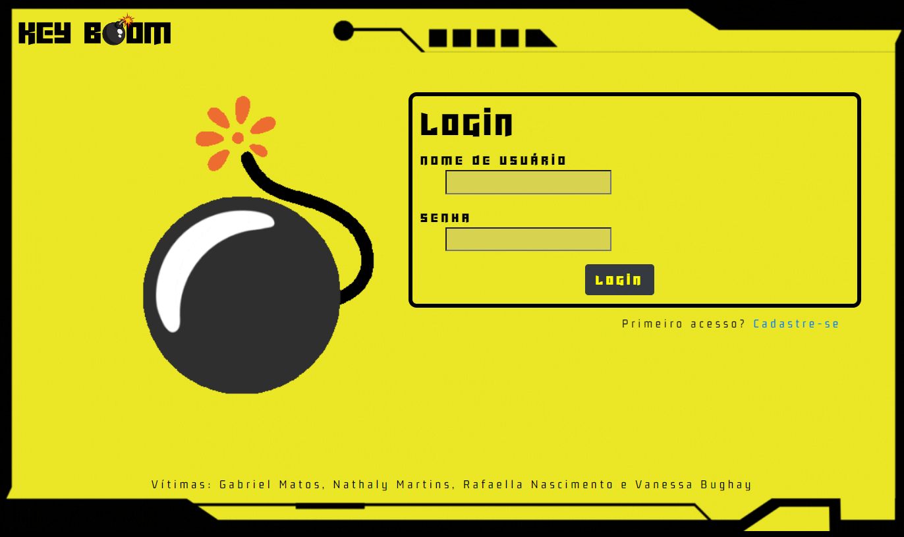
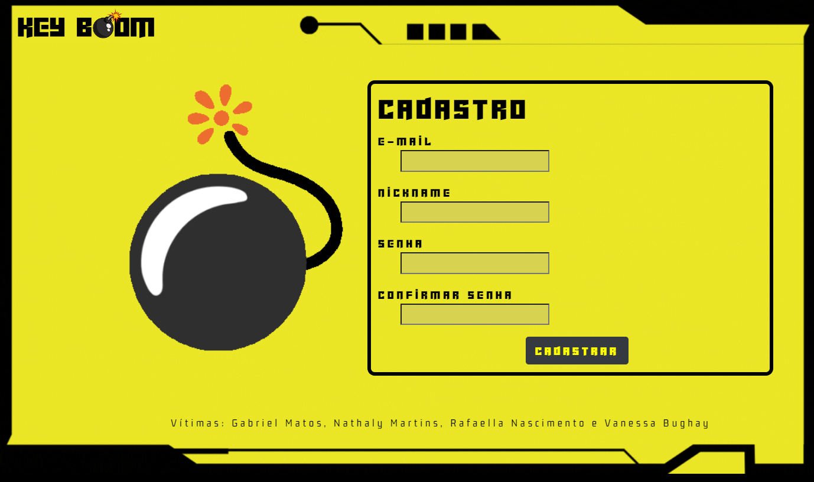
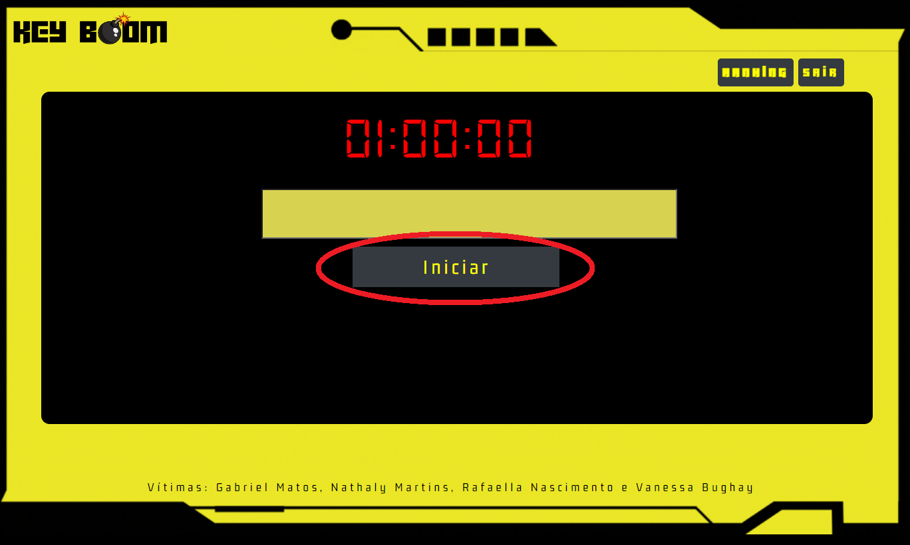
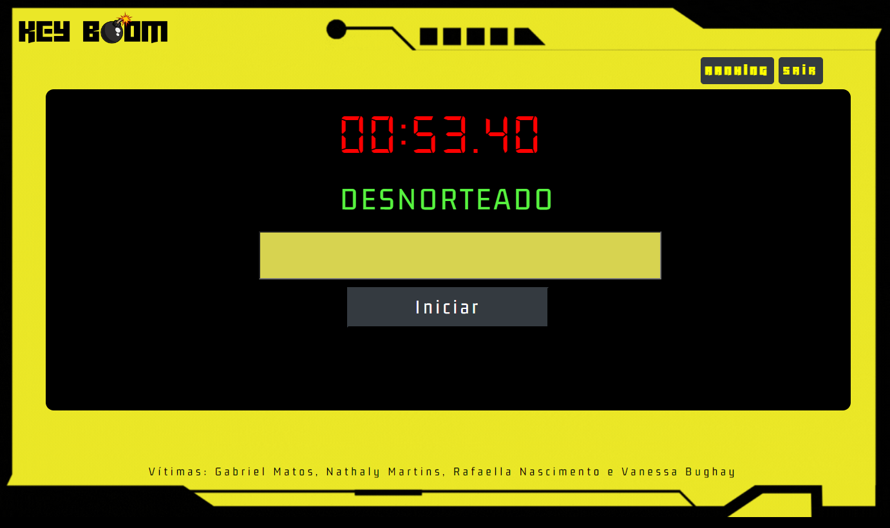
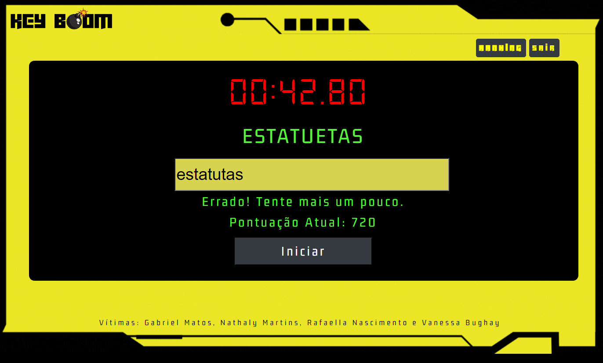
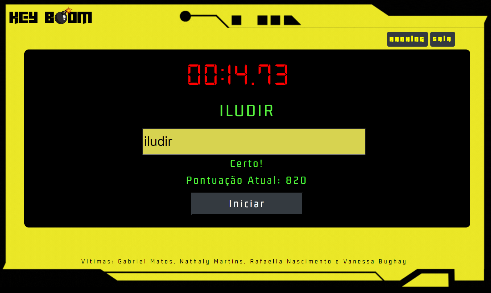
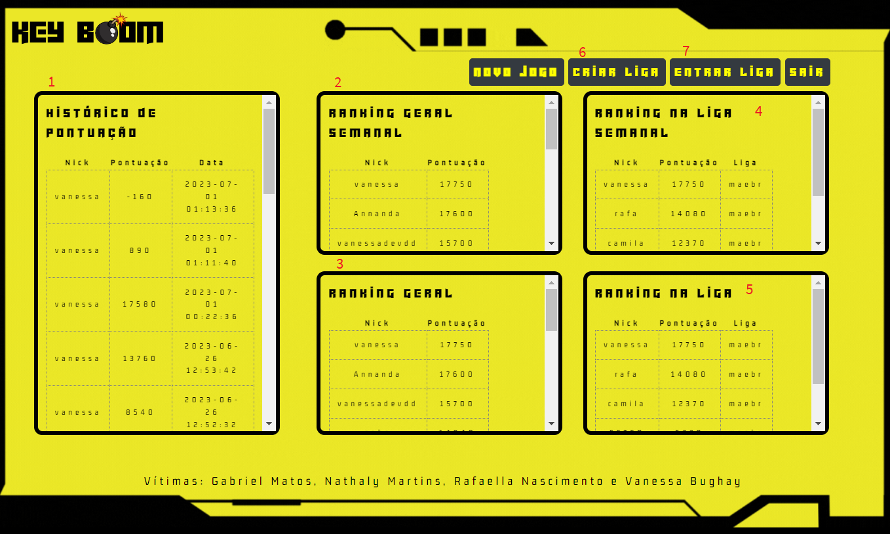
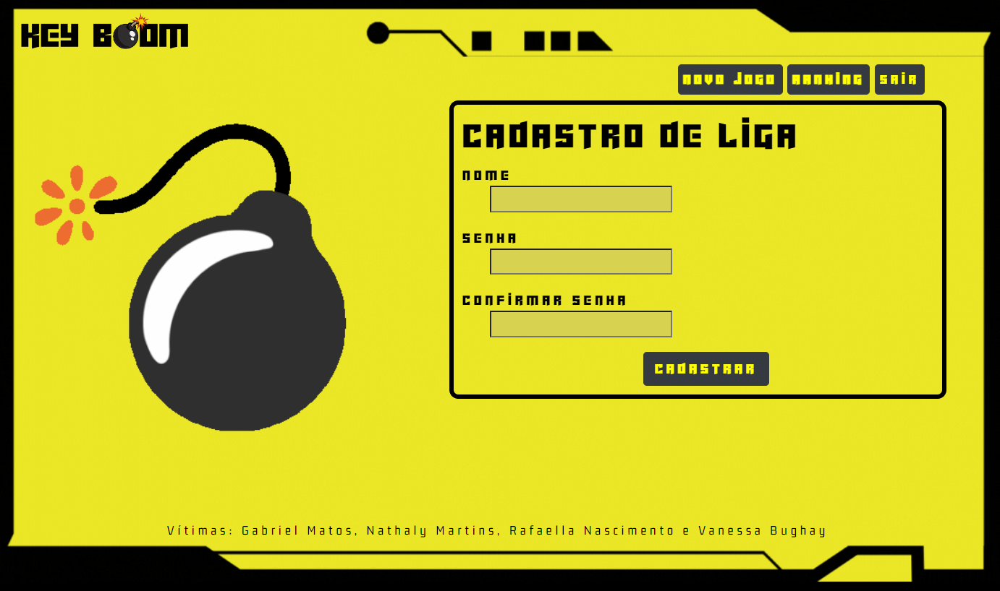
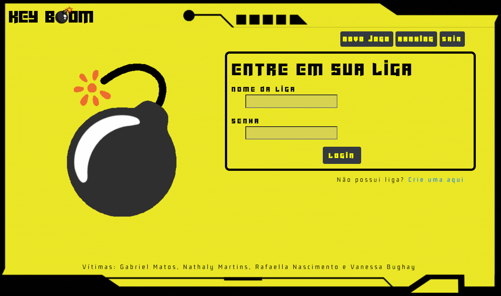

# Jogo KEY-BOOM

Jogo de digitação elaborado como trabalho de conclusão de curso da matéria DS122 - Desenvolvimento Web I, do curso de Tecnologia em Análise e Desenvolvimento de Sistemas - 1/2023.

## Índice

- [Descrição do projeto](#descrição-do-projeto)
- [Tutorial](#tutorial)
- [Tecnologias](#tecnologias)
- [Desenvolvedores](#desenvolvedores-do-projeto)

## Descrição do projeto

O projeto é idealizado como um jogo de digitação, onde a interação do usuário com o teclado é o foco central.
Deste modo, ao se iniciar uma nova partida, um cronometro indicando 1 minuto (60 segundos) começa uma contagem regressiva. Nisso, palavras aparecem na tela e o jogador tem o objetivo de digitar, em um campo disponibilizado, o maior número de palavras certas até o tempo acabar.

Para ter acesso ao jogo, o usuário tem que criar e acessar uma conta pessoal, que é criada utilizando os recursos de cadastro e login do projeto.

O desempenho do jogador é registrado em cada partida, permitindo a visualização do histórico de pontuações, além da comparação do melhor desempenho de cada jogador entre todos os jogadores e dentro de ligas.

O jogo é disponibilizado de maneira online e pode ser acessado utilizando um navegador web em um computador. Sem necessidade de instalações ou pré-requisitos especiais.

## Tutorial

### Início

Para acessar o jogo, clicar no botão "INICIAR".

### Login

O jogador deve informar o login e senha. Caso seja o primeiro acesso, clicar em "Cadastre-se".

### Cadastro

Para realizar o cadastro, o jogador deve informar e-mail, nickname e senha. Caso o e-mail e o nome de usuário estejam disponíveis, o cadastro será realizado.

### Jogar!

Ao iniciar o jogo, o jogador deve clicar no botão "Iniciar". A primeira palavra a ser digitada irá aparecer e o temporizador iniciará a contagem regressiva. Cada partida tem a duração de 1 minuto.

O jogador deve digitar a palavra corretamente no campo de texto e confirmar apertando a tecla "enter". A tela exibirá se a palavra foi digitada corretamente.

### Palavra incorreta

Se a palavra for digitada de forma incorreta, a mensagem "Errado! Tente mais um pouco." será exibida abaixo do campo de texto. O jogador deve corrigir o(s) erro(s) de digitação para passar para a próxima palavra.

### Palavra correta

Se a palavra for digitada corretamente, ao apertar a tecla "enter", será exibida a mensagem "Certo!" e uma nova palavra aparecerá para digitação.

### Pontuação

A cada letra digitada, o jogador perde 10 pontos. 
Ao acertar a palavra, o jogador ganha 1000 pontos.
A pontuação da partida é a soma da pontuação de cada palavra digitada no período de 60 segundos.

### Ranking

1 - Histórico de pontuação: Exibe todas as pontuações do jogador, ordenadas em ordem decrescente, da mais recente para mais antiga.

2 - Ranking Geral Semanal: Exibe a melhor pontuação de todos os jogadores em partidas realizadas nos últimos 7 dias.

3 - Ranking Geral: Exibe a melhor pontuação de todos os jogadores desde o início do jogo.

4 - Ranking da Liga Semanal*: Exibe a melhor pontuação dos jogadores inscritos na mesma liga do jogador logado em partidas realizadas nos últimos 7 dias.

5 - Ranking da Liga*: Exibe a melhor pontuação dos jogadores inscritos na mesma liga do jogador logado desde o iníceio do jogo.

* As tabelas de Ranking da Liga são apenas exibidas para jogadores inscritos em alguma liga.

6 - Criar liga (ver abaixo)

7 - Entrar liga (ver abaixo)

### Criar uma liga

Se o jogador desejar criar uma liga, deve informar o nome da nova e definir uma senha de acesso. Apenas jogadores com a senha poderão entrar na liga criada.

### Entrar em uma liga

Caso o jogador deseje entrar em uma liga já existente, ele deve informar o nome da liga e a senha de acesso. Ao inscrever-se em uma liga, o jogador poderá ver o Ranking da Liga.

## Tecnologias

As tecnologias utilizadas no desenvolvimento e suporte deste projeto são:

- [Apache](https://www.apache.org/)
- [Bootstrap](https://getbootstrap.com/)
- [CSS](https://developer.mozilla.org/pt-BR/docs/Web/CSS)
- [JavaScript](https://developer.mozilla.org/pt-BR/docs/web/javascript/guide/introduction)
- [HTML](https://developer.mozilla.org/pt-BR/docs/Web/HTML)
- [MySQL](https://www.mysql.com/)
- [PHP](https://www.php.net/)
- [SQL](https://mysql.com/)
- [XAMPP](https://www.apachefriends.org/pt_br/index.html)

## Desenvolvedores do projeto

Os criadores e desenvolvedores do projeto são:

- GABRIEL OLIVEIRA DE MATOS
(GRR20223385)
- NATHALY MARTINS DA CUNHA 
(GRR20223387)
- RAFAELLA JULIANA STEINHILBER DO NASCIMENTO
(GRR20223397)
- VANESSA BUGHAY GAEBLER
(GRR20220861)
